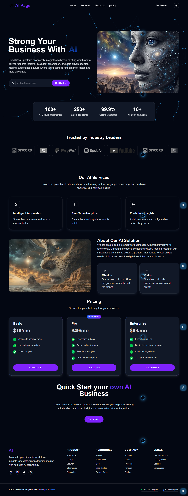
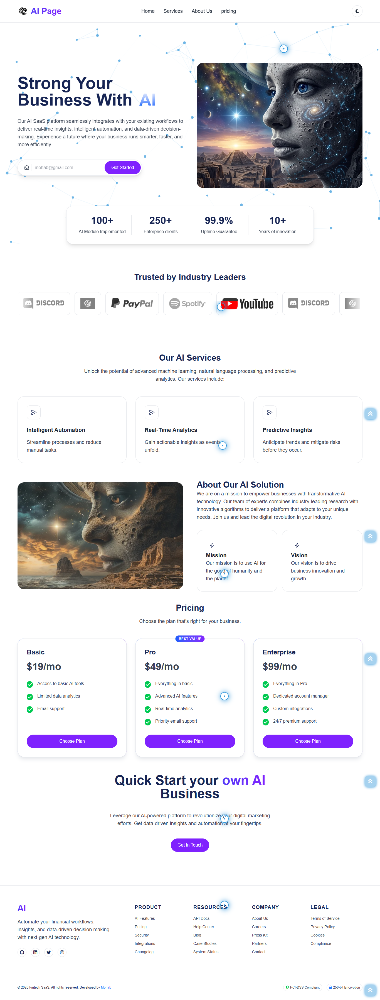

# 🚀 Modern Landing Page

A sleek, responsive, and high-performance landing page built with modern web technologies. This project focuses on clean architecture, type safety, and pixel-perfect UI design.

[🌐 Live Demo](https://modern-landing-page-sable-omega.vercel.app/)

## ✨ Features

* **Fully Responsive Design:** Optimized for all screen sizes (Mobile, Tablet, and Desktop).
* **Type Safety:** Built with TypeScript to ensure robust, bug-free components.
* **Modern UI/UX:** Styled using Tailwind CSS for a clean, professional aesthetic.
* **Component-Driven Architecture:** Reusable, isolated, and maintainable components.
* **Optimized Performance:** Fast loading times and smooth animations.

* ## 🛠️ Tech Stack

* **Framework:** React.js
* **Language:** TypeScript
* **Styling:** Tailwind CSS
* **Icons:** Fontawesome
* **Animation:** Canvas

* ## 📸 Preview

 | 
